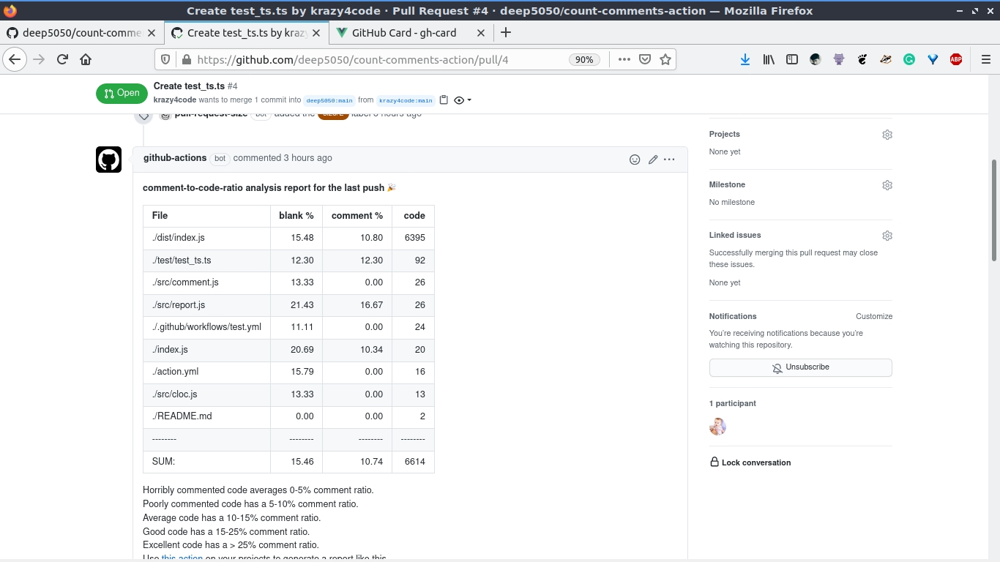

# count-comments-action
count number of comments the codebase of a PR before you merge :tada:

## Example



#### comment-to-code-ratio analysis report for this PR :tada:
        
 File|blank %|comment %|code
:-------|-------:|-------:|-------:
./dist/index.js|15.72|10.77|6403
./README.md|10.18|0.00|547
./index.js|26.58|0.00|58
./.github/workflows/test.yml|13.79|0.00|25
./action.yml|17.39|0.00|19
./report.md|20.83|0.00|19
./.github/workflows/meme.yml|11.76|0.00|15
./logo.svg|0.00|0.00|1
--------|--------|--------|--------
SUM:|15.46|9.88|7087


 
 Horribly commented code averages 0-5% comment ratio.
 
 Poorly commented code has a 5-10% comment ratio.
 
 Average code has a 10-15% comment ratio.
 
 Good code has a 15-25% comment ratio.
 
 Excellent code has a > 25% comment ratio.
 

 Use [this action](https://github.com/deep5050/comment-to-code-ratio-action) on your projects to generate a report like this.
 
 ## How to use
 
 ```yaml
 
name: "test"
on:
  pull_request_target:
    types: [opened, reopened]

jobs:
  test:
    name: setup environment
    runs-on: ubuntu-latest
    steps:
      - name: chekckout PR codebase
        uses: actions/checkout@v2
        with:
          ref: ${{ github.event.pull_request.head.sha }}
        
      - name: install cloc
        uses: actions/setup-node@v1
        with:
          node-version: '12'
      - run: sudo npm install cloc -g
        
      - name: count and reply
        uses: deep5050/count-comments-action@main
        with:
          GITHUB_TOKEN: ${{ secrets.GITHUB_TOKEN }}
          issue_number: 1
          options: '--quiet ./ --hide-rate --git --unix --md --out=report.md --timeout=20 --by-percent=cmb --by-file-by-lang --exclude-dir=node_modules, --exclude-lang=JSON,XML,YAML,YML'
 
 ```
 
 ## Related
 
 [](https://github.com/deep5050/comment-to-code-ratio-action)
 
 [](https://github.com/deep5050/cppcheck-action)
